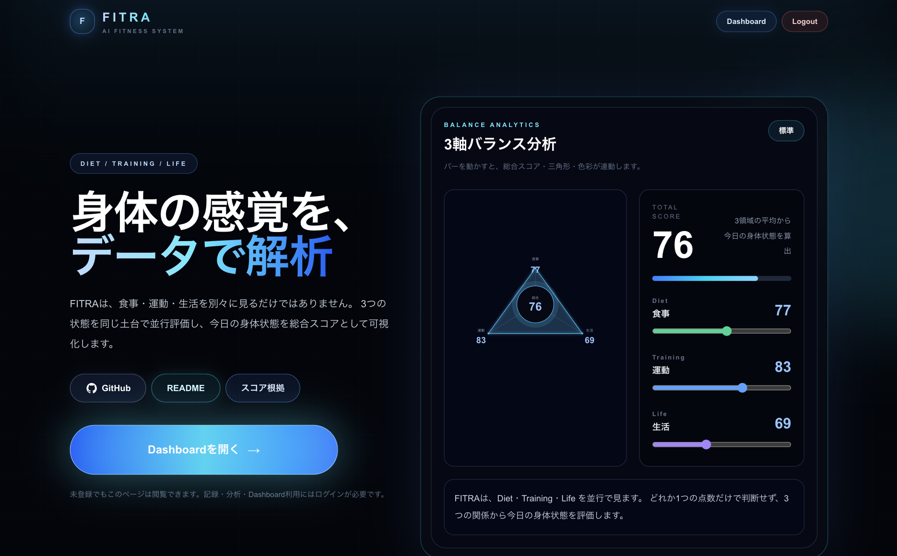
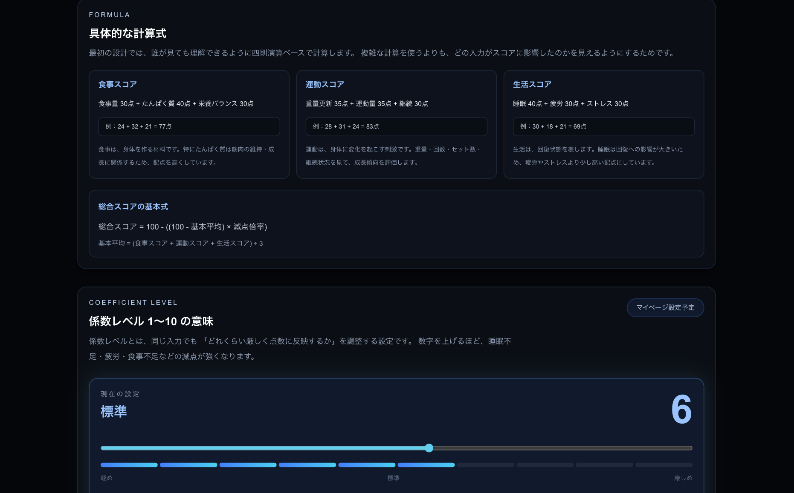

# FITRA — AIフィットネス管理アプリ

AIを活用して、食事・運動・生活をまとめて管理するフィットネス記録アプリです。

FITRAは、自身の過去の経験と、プロ格闘家である弟からのアドバイスをきっかけに企画しました。  
日々の食事・トレーニング・生活状態を記録し、心身の健康状態をできるだけリアルに可視化・数値化することで、ユーザーのモチベーション向上につなげることを目的にしています。

このアプリは、完成して終わりではなく、実際に使ってもらい、ユーザーの声を聞きながら改善していくことを前提にしています。  
記録、分析、改善を繰り返しながら、アプリ自体も成長していくものとして設計しています。

---

## 目次

- [概要](#概要)
- [開発背景](#開発背景)
- [本番URL](#本番url)
- [デモ / スクリーンショット](#デモ--スクリーンショット)
- [主な機能](#主な機能)
- [画面構成](#画面構成)
- [認証機能](#認証機能)
- [使用技術](#使用技術)
- [システム構成](#システム構成)
- [セットアップ](#セットアップ)
- [環境変数](#環境変数)
- [デプロイ](#デプロイ)
- [開発で意識した点](#開発で意識した点)
- [苦労した点](#苦労した点)
- [現在の注意点](#現在の注意点)
- [今後の改善予定](#今後の改善予定)
- [本番環境に関する補足](#本番環境に関する補足)

---

## 概要

FITRAは、食事・トレーニング・生活習慣を個別に記録し、それぞれの分析結果を統合Dashboardに集約するAIフィットネス管理アプリです。

主な目的は、以下を見える化することです。

- 今日の身体状態
- 食事の改善ポイント
- トレーニングの成長傾向
- 睡眠・疲労・ストレスによる回復状態
- 食事・運動・生活を統合した総合スコア

食事だけ、運動だけ、生活だけを単体で見るのではなく、3つの状態を同じ土台で並行評価し、身体状態を総合的に判断できるようにしています。

---

## 開発背景

FITRAは、自分自身の経験と、プロ格闘家である弟からのアドバイスをきっかけに企画しました。

トレーニングや食事管理は、継続すること自体が難しく、感覚だけで続けていると、成長しているのか、疲れているのか、食事が足りているのかが見えにくくなります。

また、身体の状態はトレーニングだけで決まるものではありません。  
食事、睡眠、疲労、ストレスなどが重なって、今日のパフォーマンスや回復状態が決まります。

そこで、FITRAでは以下の考え方を重視しました。

- 食事・運動・生活を別々に記録する
- それぞれをスコア化して見えるようにする
- 最終的に統合Dashboardで身体状態をまとめて確認できるようにする
- ユーザーが「次に何を改善すべきか」を判断しやすくする
- 数値化によってモチベーションを上げられるようにする

このアプリは、これで完成ではなく、ユーザーのアンケートや利用状況をもとに、改善を続けていく前提です。  
インプットとアウトプットを繰り返しながら、より実用的な健康管理・フィットネス管理アプリへ育てていくことを想定しています。

---

## 本番URL

- Production URL：デプロイ後に記載
- GitHub Repository：https://github.com/muraokajade/FITRA

---

## デモ / スクリーンショット

画像は `docs/images/` 配下に置く想定です。

画像ファイルの配置例：

~~~txt
docs/images/home.png
docs/images/dashboard.png
docs/images/diet-dashboard.png
docs/images/diet-input.png
docs/images/training-dashboard.png
docs/images/training-input.png
docs/images/life.png
docs/images/score-logic.png
~~~

Markdownでは、以下のように書くと画像を表示できます。

~~~md

~~~

### HOME

<!-- ここに HOME 画面のスクリーンショットを配置 -->

### 統合Dashboard

<!-- ここに 統合Dashboard のスクリーンショットを配置 -->

### 食事Dashboard

<!-- ここに 食事履歴・スコア確認画面のスクリーンショットを配置 -->

### 食事入力・AI分析

<!-- ここに 食事入力・AI分析画面のスクリーンショットを配置 -->

### トレーニングDashboard

<!-- ここに トレーニング成長Dashboardのスクリーンショットを配置 -->

### トレーニング記録

<!-- ここに トレーニング記録画面のスクリーンショットを配置 -->

### 生活スコア

<!-- ここに Life 画面のスクリーンショットを配置 -->

### スコアロジック

<!-- ここに スコア根拠ページのスクリーンショットを配置 -->

---

## 主な機能

### 1. 統合Dashboard

食事・トレーニング・生活の分析結果を統合し、今日の身体状態を表示します。

主な表示内容：

- 総合スコア
- 食事 / トレーニング / 生活の領域別スコア
- 直近スコア推移
- 今日の改善優先エリア
- 今日のアクション提案
- 保存済み分析データの履歴

---

### 2. 食事管理

食事内容を入力し、AIによって食事評価を行います。

主な機能：

- 食事内容の入力
- 食品リストの追加
- 画像アップロードによる食事分析
- 1食単位のAI評価
- 1日単位の総合食事評価
- 食事ログのDB保存
- 食事履歴Dashboardでスコア推移を確認

導線：

- `/diet/dashboard`：食事履歴・スコア確認
- `/diet`：食事入力・AI分析

---

### 3. トレーニング管理

トレーニング内容を記録し、重量・回数・セット数から成長傾向を可視化します。

主な機能：

- リアルタイム記録
- 通常記録 Step1〜Step3
- 種目選択
- 重量・回数・セット数入力
- 総ボリューム算出
- AIコメント生成
- トレーニングDashboardで重量推移を表示

導線：

- `/training`：トレーニングトップ
- `/training/live`：リアルタイム記録
- `/training/normal/step1`：種目選択
- `/training/normal/step2`：重量・回数・セット数入力
- `/training/normal/step3`：確認・保存
- `/training/dashboard`：成長Dashboard

---

### 4. 生活管理

睡眠・疲労・ストレスから生活スコアを算出します。

主な機能：

- 睡眠時間入力
- 疲労度入力
- ストレス度入力
- 入力済み項目だけで生活スコアを100点換算
- 睡眠 / 疲労 / ストレスの詳細分析
- 生活ログのDB保存
- localStorageによる暫定スコア履歴表示

導線：

- `/life`：生活スコア画面
- `/life/sleep`：睡眠詳細
- `/life/fatigue`：疲労詳細
- `/life/stress`：ストレス詳細

---

### 5. スコアロジック

FITRAの総合スコアは、食事・運動・生活の3領域をもとに算出しています。

特徴：

- 3領域を同じ土台で並行評価
- どれか1つだけ良くても総合スコアが上がりきらない設計
- バー操作により、スコア変化を視覚的に確認可能
- 三角形のバランス表示で、身体状態の偏りを把握可能

導線：

- `/score-logic`：スコア根拠確認ページ

---

## 画面構成

### 公開ページ

| URL | 内容 |
|---|---|
| `/` | LP / アプリ紹介 / ログイン導線 |
| `/login` | ログイン |
| `/register` | 新規登録 |
| `/score-logic` | スコア根拠確認 |

### ログイン後ページ

| URL | 内容 |
|---|---|
| `/dashboard` | 統合Dashboard |
| `/diet/dashboard` | 食事履歴Dashboard |
| `/diet` | 食事入力・AI分析 |
| `/training` | トレーニングトップ |
| `/training/dashboard` | トレーニング成長Dashboard |
| `/training/normal/step1` | 通常記録 Step1 |
| `/training/normal/step2` | 通常記録 Step2 |
| `/training/normal/step3` | 通常記録 Step3 |
| `/life` | 生活スコア |
| `/life/sleep` | 睡眠詳細 |
| `/life/fatigue` | 疲労詳細 |
| `/life/stress` | ストレス詳細 |

---

## 認証機能

Firebase Authentication を使用しています。

### 認証方式

- Email / Password 認証
- Firebase Authentication
- ログイン状態の永続化
- ログアウト機能

### 認証保護

ログイン後に利用する主要ページは `AuthGuard` によって保護しています。

対象：

- `/dashboard`
- `/diet`
- `/diet/dashboard`
- `/training`
- `/training/dashboard`
- `/life`

未ログイン状態でアクセスした場合は `/login` にリダイレクトします。

---

## 使用技術

### フロントエンド

- Next.js
- React
- TypeScript
- Tailwind CSS
- Recharts
- Firebase Authentication

### API / サーバー処理

- Next.js API Routes
- Prisma
- OpenAI API
- REST API

### データベース

- Prisma ORM
- Neon
- PostgreSQL

主なテーブル：

- TrainingSession
- TrainingEntry
- TrainingAnalysis
- DietAnalysis
- MealLog
- LifeLog
- LifeAnalysis

### デプロイ

- Vercel
- Neon
- Firebase Authentication

---

## システム構成

~~~txt
[ Browser ]
    |
    v
[ Next.js App ]
    |
    | Firebase Auth
    v
[ Firebase Authentication ]

[ Next.js API Routes ]
    |
    | Prisma
    v
[ Neon / PostgreSQL ]

[ OpenAI API ]
    |
    v
Diet / Training / Life Analysis
~~~

---

## セットアップ

### 1. リポジトリをクローン

~~~bash
git clone https://github.com/muraokajade/FITRA.git
cd FITRA
~~~

### 2. 依存関係をインストール

~~~bash
npm install
~~~

### 3. 環境変数を設定

`.env.local` を作成し、必要な環境変数を設定します。

~~~bash
touch .env.local
~~~

### 4. Prisma Client を生成

~~~bash
npx prisma generate
~~~

### 5. 開発サーバーを起動

~~~bash
npm run dev
~~~

---

## 環境変数

~~~env
DATABASE_URL=

OPENAI_API_KEY=

NEXT_PUBLIC_FIREBASE_API_KEY=
NEXT_PUBLIC_FIREBASE_AUTH_DOMAIN=
NEXT_PUBLIC_FIREBASE_PROJECT_ID=
NEXT_PUBLIC_FIREBASE_APP_ID=
~~~

---

## デプロイ

Vercel にデプロイしています。

### Vercelで必要な環境変数

~~~env
DATABASE_URL
OPENAI_API_KEY
NEXT_PUBLIC_FIREBASE_API_KEY
NEXT_PUBLIC_FIREBASE_AUTH_DOMAIN
NEXT_PUBLIC_FIREBASE_PROJECT_ID
NEXT_PUBLIC_FIREBASE_APP_ID
~~~

### Prisma Client 生成

Vercel上で Prisma Client が古くなる問題を防ぐため、build script に `prisma generate` を含めています。

~~~json
{
  "scripts": {
    "build": "prisma generate && next build"
  }
}
~~~

---

## 開発で意識した点

### 1. 自分自身が使う前提で作る

FITRAは、見た目だけのアプリではなく、自分自身が実際に使う前提で作りました。

特にトレーニング記録は、開発後に実際に試運転しながら改善しました。  
机上の設計だけではなく、実際にジムで使うとどう感じるか、入力しやすいか、あとから成長を見返せるかを意識しています。

---

### 2. 食事・運動・生活を無理に同じDB構造へ統一しない

FITRAでは、食事・トレーニング・生活のデータ構造を完全に統一していません。

理由は、それぞれの記録単位が異なるためです。

- 食事：MealLog / FoodItem / DietAnalysis
- トレーニング：TrainingSession / TrainingEntry / TrainingAnalysis
- 生活：LifeLog / LifeAnalysis

そのため、DB側を無理に1つへまとめるのではなく、Dashboard表示前に共通形式へ整理して表示しています。

---

### 3. AI分析を文章生成だけで終わらせない

AIの回答を単なるコメント表示で終わらせず、スコア・履歴・改善優先・Dashboard表示へ反映することを意識しました。

ユーザーが「良かった」「悪かった」で終わるのではなく、次に何を改善すべきか判断できるようにしています。

---

### 4. モチベーションにつながる数値化

健康管理やフィットネスは、変化が見えないと継続が難しくなります。

そのためFITRAでは、記録した内容をスコアやグラフとして表示し、ユーザーが自分の状態を振り返れるようにしています。

目的は、ユーザーを評価することではなく、身体の状態を見える化して、次の行動につなげることです。

---

### 5. 本番環境で動くことを優先

ローカルで動くだけでなく、Vercel / Neon / Firebase Authentication を使い、本番環境でログイン・DB保存・Dashboard反映まで確認しています。

---

### 6. localStorageとDB保存の役割を分ける

入力途中の状態保持には localStorage を使い、確定データはDBへ保存する方針にしています。

Diet / Life などでは、入力途中の状態が消えないようにしつつ、DB保存後は必要に応じて状態をリセットする設計にしています。

---

## 苦労した点

### 1. トレーニング記録を、実際の利用シーンに合わせて作り直したこと

一番苦労したのは、アプリ完成後に実際に試運転してから、トレーニング記録の設計を作り直した点です。

当初は、通常の入力フォームでトレーニング内容を記録する形にしていました。  
しかし実際に使ってみると、トレーニング中はスマホを使って、その場で重量・回数・セット数を記録できた方が自然だと感じました。

そこで、以下の2つの記録方式を用意しました。

- 通常記録：トレーニング後にまとめて入力する形式
- リアルタイム記録：トレーニング中にスマホから即時記録する形式

この2つは入力形式と保存タイミングが異なります。

特にリアルタイム記録では、1セットごとにデータを保存するため、通常記録とはデータ構造が変わります。  
そのままDashboardに表示すると、ユーザーが正確な成長データを見られなくなる可能性がありました。

そのため、DB構造を無理に1つへ統一するのではなく、画面表示前にデータを整形する処理を挟みました。

この対応では、以下の点で苦労しました。

- 通常記録とリアルタイム記録で保存形式が異なる
- それぞれのデータを同じDashboardに表示する必要がある
- 重量・回数・セット数・総ボリュームを正しく扱う必要がある
- ユーザーから見たときに、記録方式の違いを意識させない必要がある
- 設計書、DB設計、実装をあとから修正する必要があった

結果として、DB側を無理に統一するのではなく、表示前に共通形式へ変換する設計にしました。  
この判断によって、通常記録とリアルタイム記録の両方を残しつつ、Dashboardでは成長傾向を同じ画面で確認できるようにしました。

---

### 2. AIに送るプロンプト設計

2つ目に苦労したのは、AIに送るプロンプトの調整です。

最初は、入力内容をそのままAIへ渡すだけでもある程度のコメントは返ってきました。  
しかし、それだけでは評価の粒度や言葉遣いが安定せず、ユーザーに返す内容としては不十分でした。

特に食事分析では、以下の点で調整が必要でした。

- 食事内容をどう解釈させるか
- 不足している栄養をどう表現するか
- 厳しすぎる表現にならないようにする
- 逆に、曖昧すぎて改善点が伝わらない状態を避ける
- ユーザーが簡単に入力しても、なるべく正確なフィードバックを返す

AIの出力は、プロンプトの書き方によってかなり変わります。  
そのため、単に「AIに分析させる」だけではなく、ユーザーにとって自然で、次の行動に移しやすい文章になるように調整しました。

今後の課題としては、食事分析のプロンプトをさらに改善し、PFCバランスの計算や、より正確な栄養評価につなげたいと考えています。

---

### 3. Lifeスコアの計算基準

3つ目に苦労したのは、生活スコアの計算基準です。

Lifeでは、睡眠・疲労・ストレスをもとに生活スコアを算出しています。  
ただし、疲労度やストレス度は主観的な入力になりやすく、数値として扱う難しさがありました。

また、医療的な診断ではないことは明記していますが、生活状態に関わる内容である以上、表現や評価の仕方には注意が必要だと考えました。

そのため、以下の点を意識しました。

- 医療診断のように見えない表現にする
- ユーザーの主観入力を前提にしたスコアとして扱う
- 入力済みの項目だけで100点換算できるようにする
- 睡眠だけ入力した場合でも、極端に低いスコアにならないようにする
- 疲労やストレスが高いほど点数が下がるように計算する

また、スコアの考え方を完全に感覚だけで作るのではなく、参考情報として、ネット上で調べた医学的・客観性のある内容を取り入れようとしました。

最終的には、診断ではなく「今日の回復状態の目安」として見せる方針にし、ユーザーが自分の状態を振り返るための補助として設計しました。

---

## 現在の注意点

- 一部の画面では、今後さらにUI調整予定です。
- MealLogには現時点でuserIdを持たせていないため、今後追加予定です。
- 一部の古い処理に `demo` ユーザー前提のコードが残っている可能性があります。
- Lifeのスコア履歴は一部localStorageを利用しています。
- テスト自動化は未対応です。
- Lifeのスコアは医療的な診断ではなく、ユーザーの入力に基づくコンディション把握の目安です。

---

## 今後の改善予定

- MealLogへのuserId追加
- ユーザー単位のデータ分離強化
- マイページ追加
- スコアロジックの詳細化
- テスト自動化
- READMEへのスクリーンショット追加
- モバイルUIの細部改善
- 本番運用を想定したエラーハンドリング強化
- 食事分析プロンプトの改善
- PFCバランス計算への対応
- Lifeスコアの参考基準の整理
- 通常記録とリアルタイム記録のさらなる統合改善
- ユーザーアンケートをもとにした改善
- 実際の利用データをもとにしたスコアロジックの見直し

---

## 本番環境に関する補足

本アプリは Vercel / Neon / Firebase Authentication を利用して構成しています。

環境変数の不足やPrisma Clientの生成漏れがあると、本番環境でDB接続やビルドに失敗するため、Vercel側に必要な環境変数を設定し、build script に `prisma generate` を含めています。

---

## 補足

FITRAは、自身の過去の経験と、プロ格闘家である弟からのアドバイスをきっかけに企画した個人開発アプリです。

AI分析、認証、DB保存、Dashboard表示、スコア可視化までを一通り実装し、実務で必要になる設計・状態管理・API連携・本番デプロイの流れを意識して作成しています。

また、心身の健康状態をリアルに可視化・数値化することで、ユーザーのモチベーションを上げることを意識しています。

特に、アプリ完成後に実際に使ってみてから、Trainingの通常記録とリアルタイム記録を分けて作り直した点は、自分の中でも大きな改善ポイントでした。  
単に機能を作るだけでなく、実際の利用シーンに合わせて設計を見直し、DB設計・表示ロジック・Dashboard反映まで修正した経験になりました。

このアプリはこれで終了ではなく、ユーザーの声を聞きながら、インプットとアウトプットを繰り返して改善していくものとして考えています。
